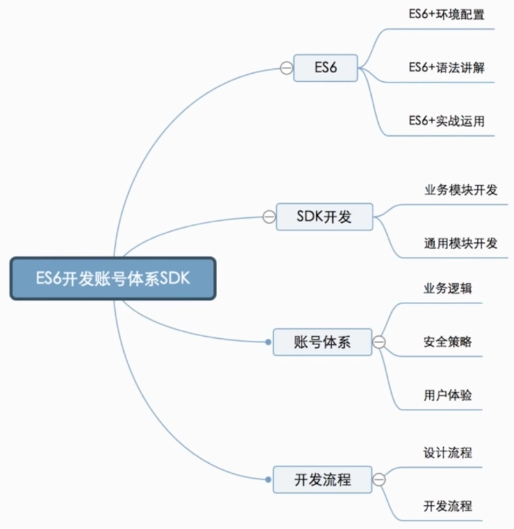

ES6实用化核心

* 可以通过.babelrc 配置文件进行配置
* 与webpack 或gulp等打包工具配合
* 在浏览器引入babel-polyfill转换新的API

https://github.com/be-fe/html-bundler

现有浏览器环境下，ES6必须转换为ES5才有实战意义
ES6实战中必用的两个工具，Webpack Babel
使用html-bundler快速创建项目并安装依赖

---

## 需求分析

1. 产品需求什么样的内容和效果
包含登录/注册/找回密码/信息设置与修改
支持PC和移动端，各子网站需要有自己的样式
功能逻辑必须统一和同步

2. 技术上需要做哪些工具达到产品要求
通过JS SDK方式，由一个团队统一开发维护，保证功能的统一以及修改同步
支持PC和移动端，因此体积要小，分包，不能有依赖
JS SDK要包含全部业务逻辑，但不包含具体样式，由下游业务方进行自定义

3. 技术上有哪些指标
浏览器兼容到IE8
支持PC和移动端，大小不能超过30kb
支持多种引用方式：直接引用、commonJs、AMD

## 前端架构设计

自顶向下，自外而内

* 对外的API接口设计
* 模块的划分与关联
* 模块的具体实现与一般性套路

## 前端对外API设计

简单易用、封装性、灵活性

* 暴露什么样的接口？ 类/普通函数/对象
* 有哪些配置项
* 默认值是什么

**如何编写公共模块***

对外暴露函数：单一功能，且无内部状态
对外暴露对象：无关联的功能集合
对外暴露Class（构造函数）：互相关联的功能集合或**存在内部状态**的功能

```html
<script>
  var login = pass.login({
    container: document.querySelector('#login-container'),
    autocomplete: false,
    success() {
      location.replace('profile.html')
    }
  })
</script>
```

## 模块的划分与关联


## 如何编写业务模块

* init 初始化，用于接受参数和设置初始值
* render 渲染
* event 事件绑定

## 真实环境搭建

babel-plugin-transform-runtime / babel-preset-env
webpack.optimize.ModuleConcatenationPlugin()  打包优化 作用域提升
DllPlugin & DllReferencePlugin 公共依赖打包 

**模块化**

静态化，必须放在顶部，不能使用条件语句，自动采用严格模式
treeshaking和编译优化，以及webpack3中的作用域提升

外部可以拿到实时值，而非缓存值(是引用而不是copy) 
可以对commonJs模块重新赋值，对ES6模块重新赋值会编译报错
都可以对对象内部的值进行改变
commonJS是对模块的拷贝，ES6是对模块的引用 

** const & let **
块级作用域
使用let 和 const 不再有变量提升，不允许重复声明

---

## 课程总结

**为什么使用ES6+**

更高的开发效率，许多API不需要自己实现，如Object.assign、Array.from等
更少的出错可能，let&const对var的优化，Symbol的引入等
更人性化的语法，箭头函数，async/await等

**常用到的ES6语法**
import & export 
let & const
箭头函数与参数优化
模版字符串
Class语法创建类
Symbol Map Set的使用

异步操作相关 Promise/async&await/fetch API


**及所需工具**
工程化工具Webpack
ES6+语法编译工具Babel 
webpack -> babel (es5-shim、babel-polyfill) -> 兼容性好的代码

**真实环境搭建**
babel-plugin-transform-runtime 
babel-preset-env
webpack.optimize.ModuleConcatenationPlugin()
不需要额外添加函数作用域的模块，统一放到同一个函数作用域下，减小体积，优化性能，必须用ES6 Module
DllPlugin & DllReferencePlugin 

### 业务模版开发套路

初始化：对外的接口，处理参数默认值
渲染：渲染模版
事件绑定：给模版上的元素绑定事件

### 通用模版开发思路

无内部状态的功能：对外暴露纯函数
存在内部状态和持久化的功能：对外暴露一个类
多功能的集合：对外暴露一个对象 

### SDK开发要点

**什么是SDK** 
软件开发工具包 Software Development Kit
SDK是对通用业务逻辑的封装
常见的领域：统计、支付、云上传、IM等

**SDK开发注意事项**
对外暴露方便友好的接口
灵活的参数配置和友好的参数默认值
尽量做到无外部依赖

### 帐号体系开发要点

**功能与体验设计**
登录、注册、找回、账户设置、安全设置
前后端都需要友好的错误提示与限制
功能的严格限制，样式和文字的灵活定制

**安全注意事项**
防止注册机：活人认证(滑动验证)
防止中间人截取和重放：https，非对称加密，key与时间戳
跨域POST请求&前后端过滤：防止XSS注入

