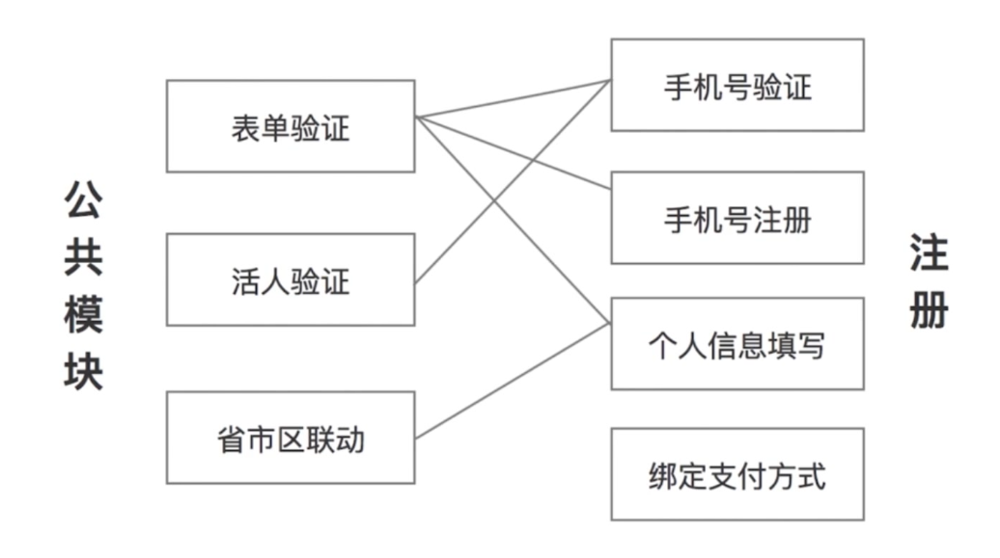

ES6实用化核心

* 可以通过.babelrc 配置文件进行配置
* 与webpack 或gulp等打包工具配合
* 在浏览器引入babel-polyfill转换新的API

https://github.com/be-fe/html-bundler

现有浏览器环境下，ES6必须转换为ES5才有实战意义

ES6实战中必用的两个工具，Webpack Babel

使用html-bundler快速创建项目并安装依赖

---

## 需求分析

1. 产品需求什么样的内容和效果
包含登录/注册/找回密码/信息设置与修改
支持PC和移动端，各子网站需要有自己的样式
功能逻辑必须统一和同步

2. 技术上需要做哪些工具达到产品要求
通过JS SDK方式，由一个团队统一开发维护，保证功能的统一以及修改同步
支持PC和移动端，因此体积要小，分包，不能有依赖
JS SDK要包含全部业务逻辑，但不包含具体样式，由下游业务方进行自定义

3. 技术上有哪些指标
浏览器兼容到IE8
支持PC和移动端，大小不能超过30kb
支持多种引用方式：直接引用、commonJs、AMD

## 前端架构设计

自顶向下，自外而内

* 对外的API接口设计
* 模块的划分与关联
* 模块的具体实现与一般性套路

## 前端对外API设计

简单易用、封装性、灵活性

* 暴露什么样的接口？ 类/普通函数/对象
* 有哪些配置项
* 默认值是什么

**如何编写公共模块***

对外暴露函数：单一功能，且无内部状态
对外暴露对象：无关联的功能集合
对外暴露Class（构造函数）：互相关联的功能集合或**存在内部状态**的功能

```html
<script>
  var login = pass.login({
    container: document.querySelector('#login-container'),
    autocomplete: false,
    success() {
      location.replace('profile.html')
    }
  })
</script>
```

## 模块的划分与关联



## 如何编写业务模块

* init 初始化，用于接受参数和设置初始值
* render 渲染
* event 事件绑定